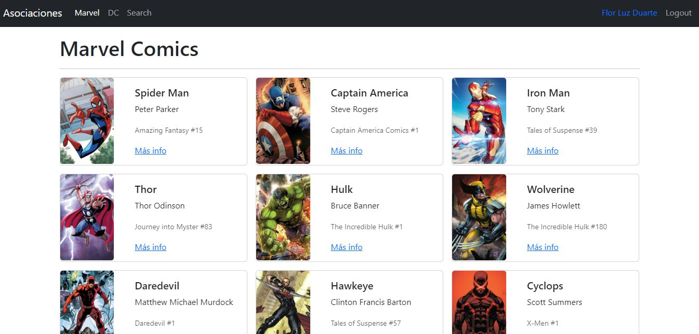

# Heroes App

## 📌 Introducción y resumen del proyecto

Un buscador de Héroes de Marvel y DC, realizado en el curso de React de Fernando Herrera [(DevTalles)](https://cursos.devtalles.com/courses/react-cero-experto?coupon=learn-01)

## 💼 Mi rol en el proyecto

- Estudiante

## 🔨 Tecnologías utilizadas

`React` --> Como framework web  
`React-router-dom` --> Para el manejo de rutas  
`JavaScript` --> Como lenguaje de programación

## 🧞 Comandos

Todos los comandos corren desde el root del proyecto, utilizando la terminal:

| Comando           | Acción realizada                                   |
| :---------------- | :------------------------------------------------- |
| `npm install`     | Instala todas las dependencias                     |
| `npm run dev`     | Inicia un server de desarrollo en `localhost:5173` |
| `npm run build`   | hace el build de producción en `./dist/`           |
| `npm run preview` | Para previsualizar el build antes de deployar      |
